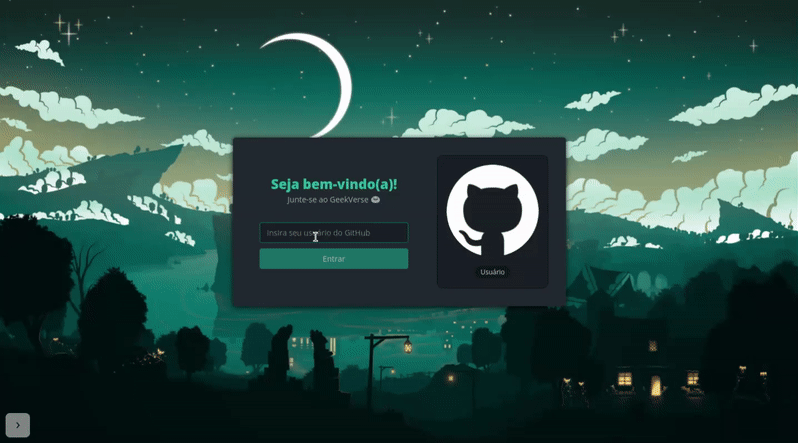

# Aluracord GeekVerse
## Projeto desenvolvido no evento de imersão React da Alura.
`O projeto GeekVerse é um aplicativo de troca de mensagens e foi desenvolvido com ReactJS/NextJS na Imersão React Alura em janeiro de 2022. Nesse projeto utilizei NextJS, React Components, CSS in JS, Styled-jsx e o SkynexUI. Para o back-end da aplicação usei o Supabase e fiz o deploy na Vercel. Se você gostou do projeto dê uma ⭐ no repositório e compartilhe!`




## Tecnologias Utilizadas
 [](https://pt-br.reactjs.org/)
 [](https://nextjs.org/)
 [](https://vercel.com/login?next=%2Fdashboard)
 [](https://supabase.com/)
  
## Status / Info


[](https://github.com/raphaelcaires/aluracord-geekverse/blob/main/LICENSE)

## Como executar o projeto

Para executar o projeto você precisa ter o [Node.js](https://nodejs.dev) e o [Git](https://git-scm.com) instalados na sua maquina. Você também precisará de um editor de textos, eu utilizei o [VSCode](https://code.visualstudio.com).

1. Clone esse repositório.

```
git clone https://github.com/raphaelcaires/aluracord-geekverse.git
```

2. Acesse a pasta do projeto.

3. Instale as dependências.

```
npm install
```

4. Execute a aplicação em modo de desenvolvimento.

```
npm run dev
```

## Link para aplicação

Você também pode conferir como ficou a aplicação pelo link do <a href="https://aluracord-geekverse.vercel.app/">GeekVerse</a>.


#

Feito com ❤️ e React por <a href="https://github.com/raphaelcaires">raphaelcaires</a>.
